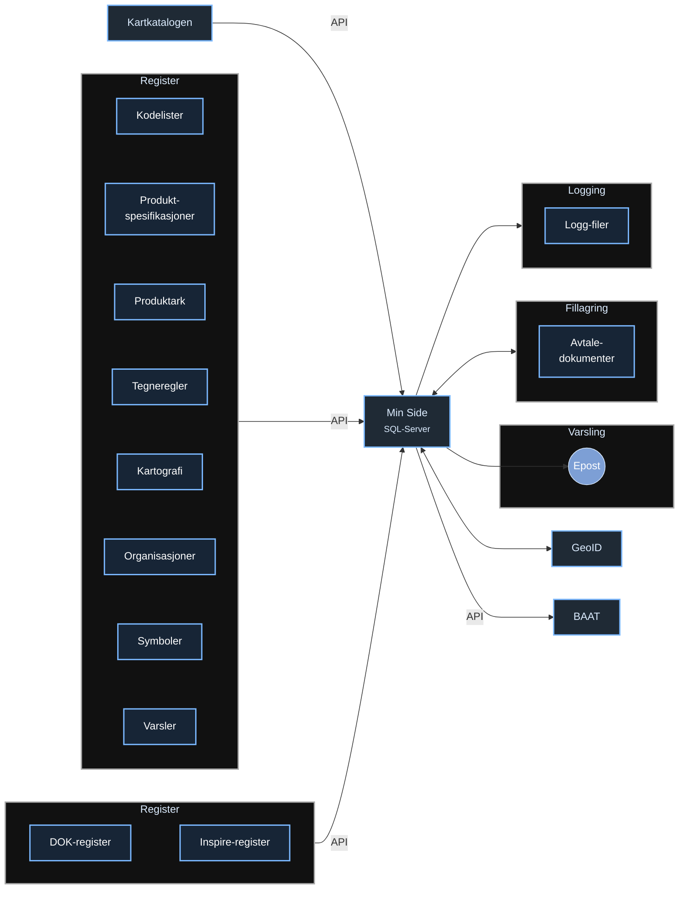

# Min Side

## Diagram

## Beskrivelse

Applikasjonen gir oversikt over innlogget brukers metadata. Bruker vil finne Norge Digitalt avtale-dokumenter, samt oppgaver man er blitt enige om under oppfølgingspunkter.

## Kjøremiljøer

| Miljø | URL |
|-------|-----|
| Dev | https://minside.dev.geonorge.no |
| Test | https://minside.test.geonorge.no |
| Produksjon | https://minside.geonorge.no |

## Teknisk
Utviklet med **.NET 8**, **C#** og **Vuejs**.
Applikasjonen benytter **GeoID** for å autentisere brukere.

### Geonorge.MinSide (Web)

ASP.NET Core MVC-applikasjonen:

- **Controllers** – Håndterer HTTP-forespørsler (MVC-views + REST API)
- **Views** – Razor-views for server-rendert brukergrensesnitt
- **Services** – Forretningslogikk (dokumenthåndtering, møtehåndtering)
- **Models** – View-modeller og applikasjonsinnstillinger
- **Utils** – Hjelpefunksjoner (innholdstype-gjenkjenning, Serilog-mellomvare)

### Geonorge.MinSide.Infrastructure

Datatilgangslaget:

- **Context** – EF Core `DbContext` (`OrganizationContext`) og entitetsdefinisjoner
- **Migrations** – EF Core databasemigrasjoner
- **Data** – Repository-implementasjoner (f.eks. `DownloadStatisticsRepository`)

### Geonorge.MinSide.Core

Domeneabstraksjoner (ingen avhengigheter til infrastruktur):

- **Models** – Domeneobjekter (`Organization`, `DownloadStatistics`)
- **Actions** – Use-case-grensesnitt
- **Repositories** – Repository-kontrakter

## Bakgrunnstjenester

Applikasjonen kjører en `TimedHostedService` som periodisk sender påminnelser på e-post til brukere som har aktivert varsling for oppgaver.

## Eksterne integrasjoner

| System | Formål | Protokoll |
|--------|--------|-----------|
| GeoID (Keycloak) | Identitetsleverandør / SSO | OpenID Connect |
| BAAT Authz API | Organisasjonsroller og tilganger | REST (HTTP) |
| Log Entry API | Sentralisert auditlogging | REST (HTTP) |
| SMTP-server | E-postvarsling | SMTP |

## Frontend

Frontenden er server-rendert med Razor-views og klient-side forbedringer:

- **Webpack 5** bundler JavaScript og Sass
- **jQuery** for DOM-manipulasjon
- **Font Awesome** for ikoner
- Vendor-biblioteker bundles separat via `webpack.config.vendor.js`
